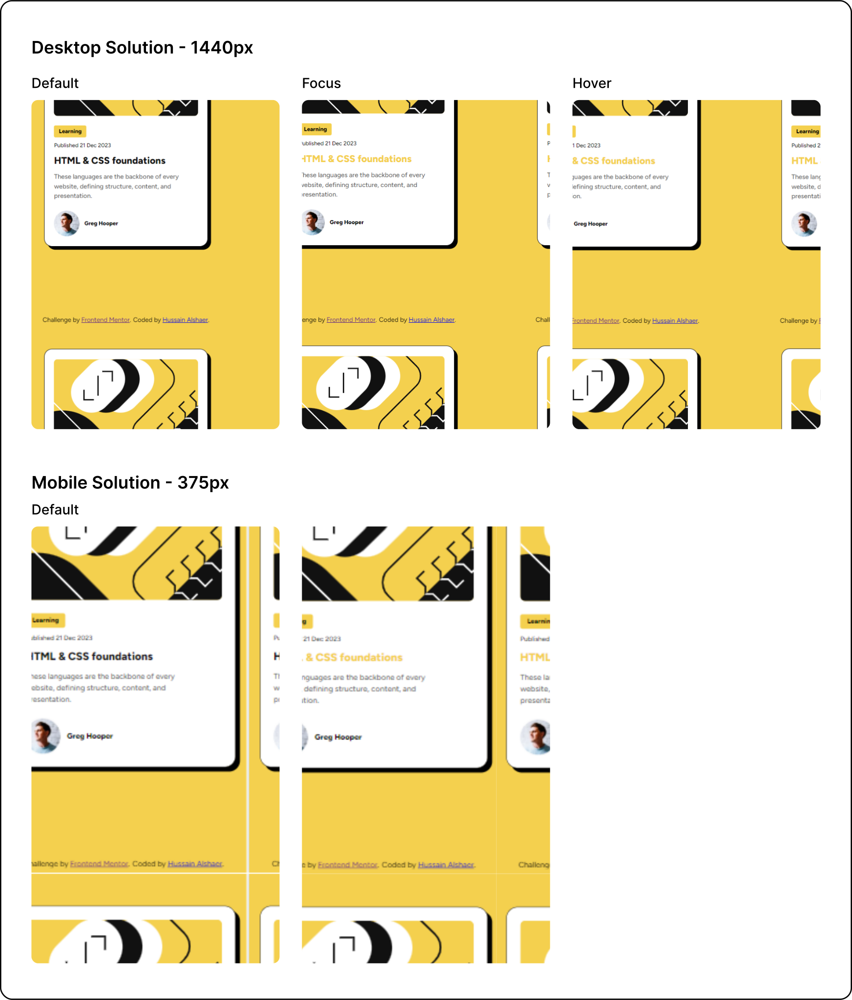

# Frontend Mentor - Blog preview card solution

This is a solution to the [Blog preview card challenge on Frontend Mentor](https://www.frontendmentor.io/challenges/blog-preview-card-ckPaj01IcS). Frontend Mentor challenges help you improve your coding skills by building realistic projects.

## Table of contents

- [Overview](#overview)
  - [The challenge](#the-challenge)
  - [Screenshot](#screenshot)
  - [Links](#links)
- [My process](#my-process)
  - [Built with](#built-with)
  - [What I learned](#what-i-learned)
  - [Continued development](#continued-development)
- [Author](#author)

**Note: Delete this note and update the table of contents based on what sections you keep.**

## Overview

### The challenge

Users should be able to:

- See hover and focus states for all interactive elements on the page

### Screenshot




### Links

- Solution URL: [Code solution](https://github.com/hussaindev94/frontend-mentor-challenges-blog-preview-card)
- Live Site URL: [Live solution](https://hussaindev94.github.io/frontend-mentor-challenges-blog-preview-card/)
- My Notes: [My notes](https://tinyurl.com/Hussain-Alshaer)

## My process

### Built with

- Semantic HTML5 markup
- CSS custom properties
- Flexbox
- CSS Grid

### What I learned
Here is what I have learned in this project:
1. Laying out your HTML elements is essential. Why?
    - Because your styles are relying on the HTML layout.
2. Chunking styling into small chunks and takle one chunk at a time is a good approach to reach to the solution.
    - Target the big element and then devide it into small chunks until you reach into a point that chunk is not devidable. The easiest way is by sketching the element.
3. Ways to use fonts in css.
   - Before this challenge:
      - I use google fonts in my projects.
   - After this chanlleng:
      - I have learned a new way of using local fonts files by using the css at-rule @font-face.

### Continued development

##### Frist of all, I would like to:
- User interaction with the card.
  - Make the box shadow appear when the user interact with the card.
- Text adjustment.
  - In the design there is a single word in the last line, which is called a "widow".
    - I would like to move it up to the upper line.
- Main title of the card.
  - Make three different color for the title.
    ```css
    .card-title{
      color: hsl(0, 0%, 7%);
    }
    .card-title:hover{
      color: hsl(47, 88%, 63%);
    }
    .card-title:focus{
      color: hsl(0, 0%, 42%);
    }
    ```

## Author

- Website - [Hussain Alshaer](https://hussaindev94.github.io/Portfolio/)
- Frontend Mentor - [@hussaindev94](https://www.frontendmentor.io/profile/hussaindev94)
- Twitter - [@hussaindev94](https://www.twitter.com/hussaindev94)
